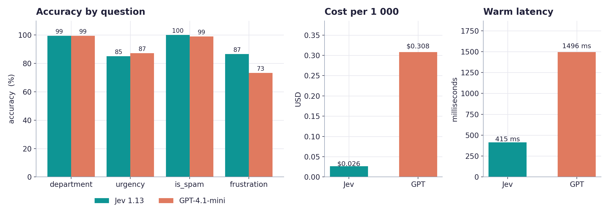
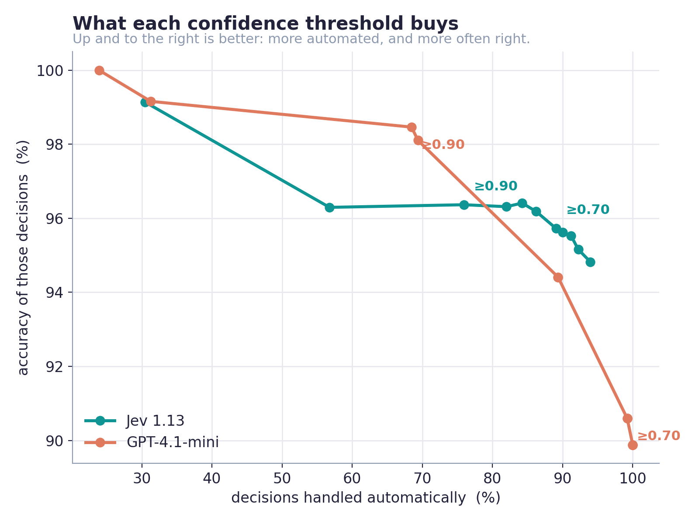
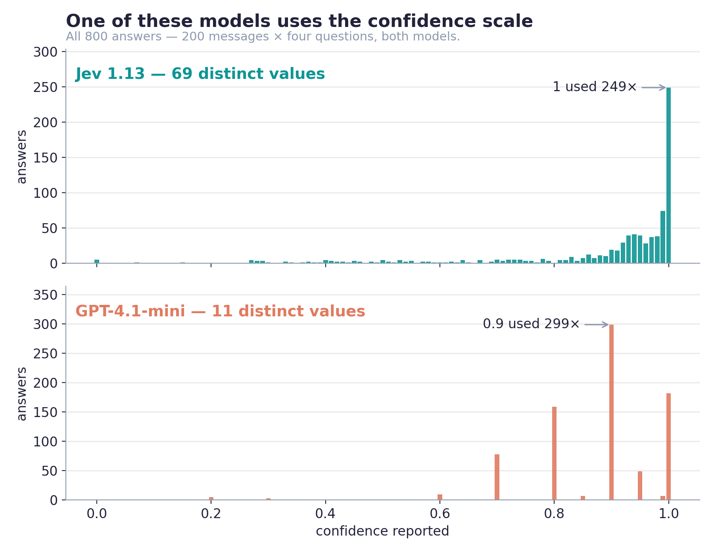
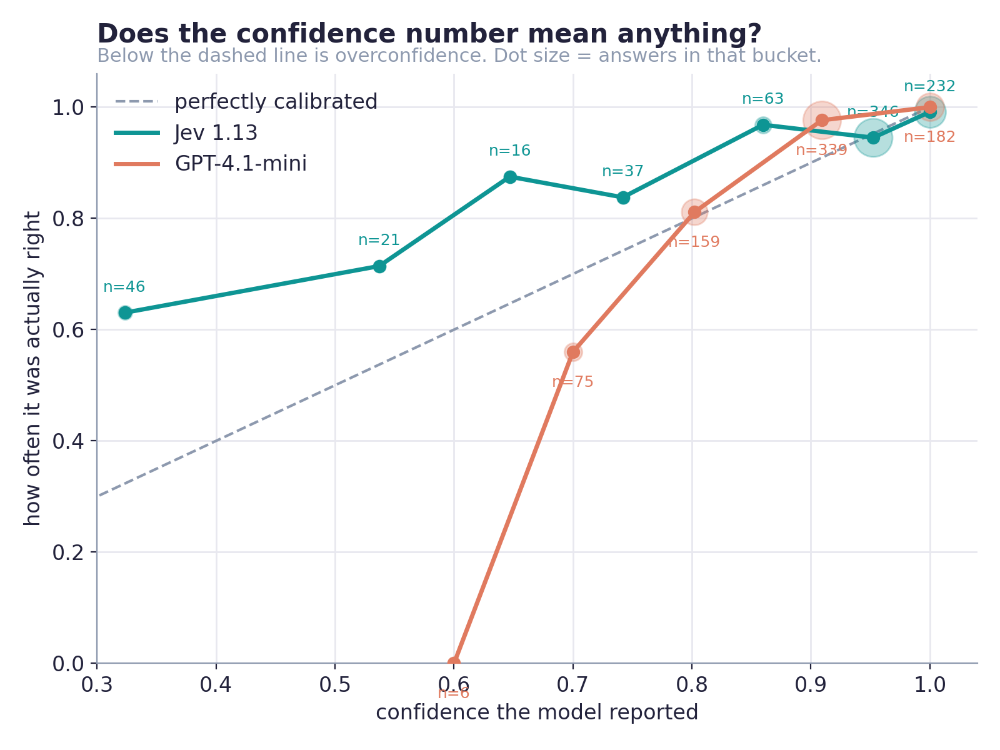
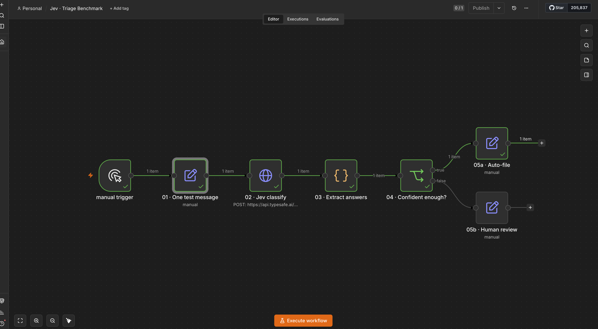
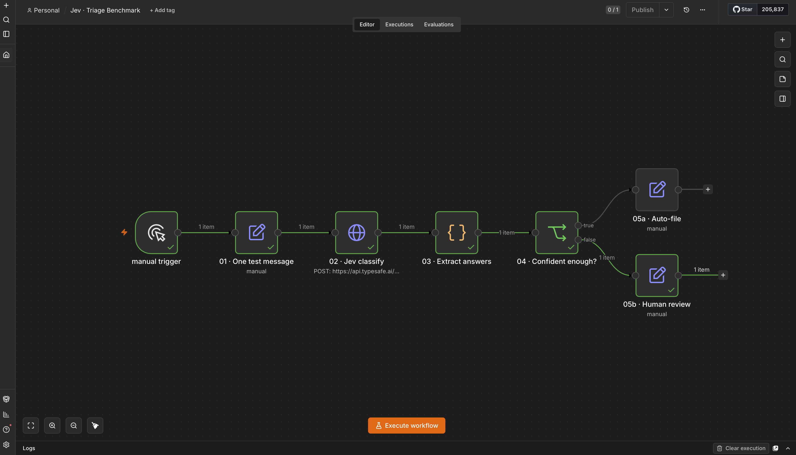

# What a calibrated confidence score is actually good for

An independent measurement of [TypeSafe AI's](https://typesafe.ai) **Jev** against **GPT-4.1-mini**, over 200 South African customer enquiries that carry **known correct answers**.

Two findings, one of which is a correction to this repository's own first version:

> **1. A badly written question cost Jev 20 points, and I published the result as a model weakness before I noticed.**
>
> **2. Confidence tells you when to ask a human. It does not tell you when to ask a bigger model.**

Every number is measured from Johannesburg and recomputable from [`results/raw.jsonl`](results/raw.jsonl).

---

## The correction, first

The first version of this benchmark published: *"Jev loses on urgency — 64.7% against GPT's 76.5%."*

Then I read [TypeSafe's guidance on writing Score levels](https://docs.typesafe.ai/primitives/score) properly:

> **"Describe situations, not degrees."**
>
> "Every level is evaluated separately. The model doesn't see a level's number or its neighbours."
>
> **"Keep each Score question to one dimension."**

My urgency levels were `Not urgent` / `Needs attention this week` / `Blocking business right now`. The first is a negation of a degree. Compare the frustration levels — `Calm` / `Frustrated` / `Very angry` — which were concrete states, and which Jev answered 22 points better.

So I rewrote three sentences as situations along one dimension, **changed nothing else**, and re-ran:

| question | v1 | v2 | change |
|---|---|---|---|
| **`urgency`** — rewritten | 64.7% | **85.0%** | **+20.3** |
| `department` — untouched control | 99.5% | 99.5% | 0.0 |
| `is_spam` — untouched control | 100.0% | 100.0% | 0.0 |
| `frustration` — untouched control | 87.2% | 86.6% | −0.6 |

The corpus messages and integer labels are byte-identical between runs; only the criteria wording the models see changed. **Three untouched controls did not move.** Urgency mean absolute error halved, 0.41 → 0.19.

GPT improved too, 76.5% → 87.2%, so this isn't a Jev quirk — good question design helps both. But **Jev was penalised roughly twice as hard by the bad version**, and its one remaining loss narrowed from 11.8 points to 2.2.

Both runs are in the repo: [`results/raw.urgency-v1.jsonl`](results/raw.urgency-v1.jsonl) and [`results/raw.jsonl`](results/raw.jsonl).

**The lesson generalises past this repo.** A benchmark measures the question as much as the model, and a question written in degrees rather than situations will quietly report a weakness that belongs to its author. TypeSafe say as much — *"treat cookbook thresholds and demo results as examples to evaluate, not universal rules or permanent model limitations"* — and this repo published exactly that mistake before correcting it.

---

## Where things landed



| | Jev 1.13 | GPT-4.1-mini |
|---|---|---|
| department | 99.5% | 99.5% |
| is_spam | **100.0%** | 99.0% |
| frustration | **86.6%** | 73.3% |
| urgency | 85.0% | **87.2%** |
| **all four combined** | **92.9%** | 89.9% |
| cost / 1 000 classifications | **$0.026** | $0.308 |
| warm median latency | **415 ms** | 1 496 ms |

**11.8× cheaper and 3.6× faster**, measured. TypeSafe publish 40–200× and ~400×; those are presumably against frontier models, and GPT-4.1-mini is already small and cheap — the hardest comparison available. Jev wins it on both while sending *more* input tokens (624 vs 479), because each question carries its own criteria.

---

## Routing question 1: "should a person look at this?"

Yes — confidence answers this well.



| threshold | Jev auto-files | at accuracy | GPT auto-files | at accuracy |
|---|---|---|---|---|
| ≥ 0.70 | **89.1%** | **95.7%** | 99.2% | 90.6% |
| ≥ 0.80 | 84.2% | 96.4% | 89.4% | 94.4% |
| ≥ 0.90 | 76.0% | 96.4% | 68.5% | 98.5% |
| ≥ 0.95 | 56.8% | 96.3% | 31.3% | 99.2% |

At ~89% automation Jev is **1.3 points more accurate**. The bigger difference is that **GPT's dial barely turns**: a 0.70 threshold lets 99.2% through, filtering almost nothing, and the only way to raise its accuracy is to automate far less. Jev's curve gives you a usable range; GPT's gives you an on switch and a cliff.

---

## Routing question 2: "should a bigger model look at this?"

No — and here it actively hurts.

TypeSafe document the pattern under *Verify and escalate*: *"send uncertain or failing cases to a person or reasoning model."* Replaying every routing policy offline over the same run ([full working](results/cascade.md)):

| policy | accuracy | cost / 1 000 |
|---|---|---|
| **Jev alone** | **92.9%** | **$0.026** |
| GPT-4.1-mini alone | 89.9% | $0.308 |
| Best confidence-routed cascade (T = 0.50) | 92.2% | $0.089 |
| *Oracle — always pick the model that was right* | *95.5%* | *$0.334* |

**Every threshold tested made it worse.** The best loses 0.7 points while costing 3.4× more. An oracle shows +2.6 points were theoretically available, so the signal isn't weak here — following it moves in the wrong direction.

The mechanism is in the docs, and it's checkable:

> *"`confidence` is a statistic computed from the probability distribution the answer already gives you."*

[`tools/verify_confidence.py`](tools/verify_confidence.py) tests that against every answer. For **Choice**, `(n × peak − 1) / (n − 1)` reproduces the reported confidence on all 400 answers, within the slack from probabilities being rounded to two decimals. For **Score** it doesn't: where mass spreads across ordered levels, Jev reports *lower* confidence than the peak-only formula, always in that direction — so Score confidence tracks dispersion across the scale, not the height of the winning level. Their published formula is stated for Choice, so this is an undocumented detail rather than a contradiction.

Which explains the cascade result exactly. Confidence is computed from the distribution over **these options for this input**. It has no channel to another model and cannot know whether one would do better. Jev is weakest on `urgency`, where GPT is better — but strongest on `frustration`, where GPT is 13 points worse. Escalating on low confidence hands some answers to a model that is worse at that particular question.

TypeSafe's own confidence guidance says the same thing for the low band: *"Route to a human, request clarification, or fall back to a different system."* The measurement separates the two halves of that sentence.

---

## Why Jev's number is worth thresholding on



Across 800 answers, **Jev used 69 distinct confidence values. GPT-4.1-mini used 11** — and `0.9` alone accounted for 299 of them.

GPT was *told* not to do this. Its system prompt says, verbatim:

> Use the full range. If a message could reasonably be routed two ways, say so with a lower confidence rather than picking one at high confidence.

It didn't. On the 23 messages written to be honestly routable two ways:

| | clean messages | genuinely ambiguous | drop |
|---|---|---|---|
| **Jev** | 0.975 | 0.580 | **−0.395** |
| GPT-4.1-mini | 0.906 | 0.861 | −0.046 |

**Nine times the drop.** One model's confidence is a function of its own distribution; the other's is a number it chose to write. Asking politely does not convert the second into the first.



Expected calibration error is close — Jev 0.048, GPT 0.050 — but the **direction** differs and matters more. Every Jev bucket below 0.90 is *under*-confident. GPT has a 0.60–0.70 bucket that is **0% accurate**. Under-confidence costs you automation you could have had; over-confidence costs you correctness you never find out about.

---

## What I'd build with this

A triage desk for a small business, where **the escalation target is a person**:

```
inbound message
      ↓
   Jev — four questions, one call, ~0.4 s, $0.000026
      ↓
confidence ≥ 0.70  →  auto-file to the right queue     (89% of traffic, 95.7% correct)
confidence <  0.70  →  a person, with the distribution shown
```

Built in n8n. Same workflow, same threshold — two messages, two destinations:



A clean billing query: `billing` at 1.00 confidence, files itself.



A message that is honestly two things at once — the account is locked *and* the payment went through. Jev answers `technical` at **0.27** and a person gets it. GPT answered the same class of message at 0.80–0.90 every time, so this branch would never have fired.

At $0.026 per thousand classifications the economics work at South African price points where an LLM-per-message pipeline doesn't.

**On the threshold.** 0.70 is read off the table above, not chosen because it's tidy — 0.80 costs 5 points of automation to buy 0.7 points of accuracy. It is also a simplification of TypeSafe's documented three-band pattern (act automatically / proceed with caution / do not act), and of their point that *thresholds should scale with the stakes of the action*: a read-only route and an irreversible one do not deserve the same number. Pick yours from your own measurements.

---

## How the corpus works

Running two models over the same messages tells you how often they agree. **Agreement is not accuracy** — two models can agree and both be wrong, and a confidently wrong model is indistinguishable from a confidently right one unless you already know the answer.

So every message is generated **from** its label rather than labelled afterwards. A template fixes the department, a tone wrapper fixes the frustration level, an urgency clause fixes the urgency. The label is the recipe, not a judgement made later by someone reading the text.

| | |
|---|---|
| Messages | 200, seed 42, fully reproducible |
| Labels | `department` · `urgency` 0–2 · `frustration` 0–2 · `is_spam` |
| Ambiguous | 23, each carrying a second acceptable department |
| Spam | 13, carrying **blank** urgency and frustration |
| Channels | email, web form, WhatsApp — identical labels across registers |
| Setting | ZAR, 15% VAT, local banks and gateways, load-shedding; every name, company and reference fictional |

**Blank is not zero.** Spam has no honest department and no honest urgency — scam mail demanding *"immediate payment"* isn't calmly unurgent, it's something the question was never meaningfully asked about. Those rows are scored on `is_spam` and skipped elsewhere.

Both models get **identical** wording, from [`tools/schema.py`](tools/schema.py), imported by the generator, the benchmark and both scorers. Defining criteria twice is how a benchmark quietly stops comparing like with like.

**Scoring a continuous answer.** Jev answers an ordered question with a continuous expectation (`0.7`), not a discrete label. Converting one to the other is a judgement, so all three readings are reported every time: **argmax** of the distribution, the **rounded** score, and **mean absolute error**. See [`results/report.md`](results/report.md).

---

## Everything that went wrong

Five defects, all found the same way — by checking the artefact rather than the summary of it.

| | |
|---|---|
| **1** | WhatsApp messages truncated at a word count, cutting *"My invoice says R687 but"* mid-sentence and removing the signal the row was labelled for. |
| **2** | Frustration wording asserted the sender had been waiting — *"Four emails. FOUR."* — on messages labelled *not urgent*. 15 rows contradicted themselves. |
| **3** | Spam rows carried an invented urgency of 0 that their own text contradicted. |
| **4** | **The urgency levels were written in degrees**, costing Jev 20 points — published as a model weakness before it was caught. |
| **5** | An `05b · Human review` node shipped with no fields set. It ran green, passed an item through, and did nothing. Found by reading the exported JSON, not the canvas. |

Defects 1–3 were caught by the same tell, worth stating on its own:

> **When two independent models agree against your ground truth, suspect your ground truth.**

Defect 3 surfaced as 37 rows where Jev and GPT overshot the same label in the same direction. Separating those from the 23 where only Jev overshot is what turned a vague suspicion into a specific fix.

---

## Reproduce it

Python 3.9+. Standard library only, except `matplotlib` to redraw the charts.

```bash
export TYPESAFE_API_KEY=...
export OPENAI_API_KEY=...

python3 tools/generate_enquiries.py           # 200 labelled enquiries, seed 42
python3 tools/run_benchmark.py --models jev,llm
python3 tools/score_results.py                # -> results/report.md
python3 tools/cascade_analysis.py             # -> results/cascade.md
python3 tools/verify_confidence.py            # -> results/confidence-formula.md
python3 tools/make_charts.py                  # -> docs/charts/
```

About 10 minutes and roughly 9 US cents, almost all of it the LLM arm.

| | |
|---|---|
| [`tools/schema.py`](tools/schema.py) | the four questions and their criteria, defined once |
| [`tools/generate_enquiries.py`](tools/generate_enquiries.py) | builds the corpus from its labels |
| [`tools/run_benchmark.py`](tools/run_benchmark.py) | both arms, keep-alive connections, cold/warm tagging |
| [`tools/score_results.py`](tools/score_results.py) | accuracy, calibration, confusion, cost, latency |
| [`tools/cascade_analysis.py`](tools/cascade_analysis.py) | routing policies replayed offline |
| [`tools/verify_confidence.py`](tools/verify_confidence.py) | is confidence just arithmetic on the probabilities? |
| [`results/raw.jsonl`](results/raw.jsonl) | every answer, confidence, distribution and timing |

Results stream to disk one line at a time and re-runs resume. Every record carries a fingerprint of the corpus it was scored against and the run **aborts** rather than blending two corpora. Failed rows are retried rather than treated as done — an earlier version counted them as complete, which silently turned one transient 520 into a permanent hole. Upstream error bodies are scrubbed of anything key-shaped before being stored or printed, because an auth failure quotes your key back at you and `raw.jsonl` is committed.

**The workflow.** Import [`workflows/jev-triage-benchmark.json`](workflows/jev-triage-benchmark.json), then create a **Header Auth** credential named `Jev v2` with name `Authorization` and value `Bearer <your key>`. [`tools/sanitise_workflow.py`](tools/sanitise_workflow.py) produced that file — it strips the instance fingerprint, ids, tags and empties `pinData`, which on a workflow that has touched real mail *is* the mail. A sanitiser only removes what it was written to remove, so read the export in full before committing it; that habit is what caught defect 5.

---

## Limits

- **One model pair, one domain, one language.** Small-business support email in South African English.
- **200 messages** separates a −0.395 confidence drop from a −0.046 one comfortably. It does not separate 99.5% from 99.5% on department, or 85.0% from 87.2% on urgency. Treat those as ties.
- **Question design is a confound**, and this repo published one as a model weakness before catching it. Any benchmark like this measures its author's questions as much as the model.
- **Synthetic messages** are cleaner than real inbound mail, so these are upper bounds for both models.
- **`is_spam` was modelled as a two-option Choice.** TypeSafe document a third primitive — **Noul** — for yes/no conditions, which is the correct shape for that question and was not tested here.
- One location, one afternoon, a model a fortnight old.

---

## Licence

MIT — see [LICENSE](LICENSE).
